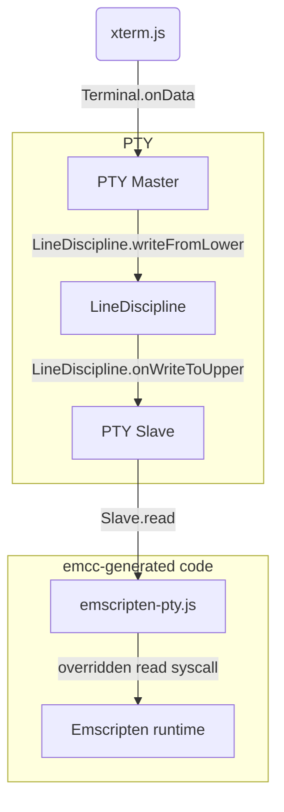
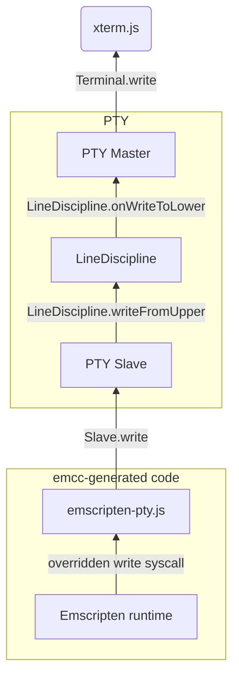

# xterm-pty

This is an addon that adds a PTY layer to xterm.js.
It is useful to run an Emscripten'ed CUI program.

See [the demo site: https://xterm-pty.netlify.app/](https://xterm-pty.netlify.app/).

## How to use

_If you want to use this library to run a CUI program built with [Emscripten](https://emscripten.org/), you can go to [Section "Emscripten integration"](#emscripten-integration)._

Install `xterm-pty` as usual.

```shell
npm i xterm-pty
```

Use `slave.write` and `slave.onReadable` instead of `Terminal.write` and `Terminal.onData` of xterm.js.

```js
// Start an xterm.js instance
const xterm = new Terminal();
xterm.open(document.getElementById('terminal'));

// Create master/slave objects
const { master, slave } = openpty();

// Connect the master object to xterm.js
xterm.loadAddon(master);

// Use slave.write instead of xterm.write
slave.write("Hello, world!\nInput your name:");

// Use slave.onReadable and slave.read instead of xterm.onData
slave.onReadable(() => {
  const input = new TextDecoder().decode(Uint8Array.from(slave.read()));
  slave.write(`Hi, ${input.trim()}!\n`);
});
```

Result:

```text
Hello, world!

Input your name: Yusuke
Hi, Yusuke!
■
```

See [examples/plain-example](https://github.com/mame/xterm-pty/tree/main/examples/plain-example) for a complete code example.

## Emscripten integration

### TL;DR

Assume you want to run [example.c](https://github.com/mame/xterm-pty/blob/master/demo/build/example.c) in xterm.js.

#### 1. Set up the latest emscripten.

See [the doc of emsdk](https://emscripten.org/docs/getting_started/downloads.html) and make sure that `emcc` is available.

#### 2. Build example.c.

```
wget https://raw.githubusercontent.com/mame/xterm-pty/refs/heads/main/demo/build/example.c
wget https://unpkg.com/xterm-pty/emscripten-pty.js
emcc -s FORCE_FILESYSTEM -s ASYNCIFY --js-library=emscripten-pty.js -o example.mjs example.c
```

#### 3. Write a HTML as follows.

```html
<!DOCTYPE html>
<html>
  <head>
    <link
      rel="stylesheet"
      href="https://unpkg.com/@xterm/xterm/css/xterm.css"
    />
  </head>
  <body>
    <div id="terminal"></div>
    <script type="module">
      import "https://unpkg.com/@xterm/xterm/lib/xterm.js";
      import { openpty } from "https://unpkg.com/xterm-pty/index.mjs";
      import initEmscripten from "./example.mjs";

      var xterm = new Terminal();
      xterm.open(document.getElementById("terminal"));

      // Create master/slave objects
      const { master, slave } = openpty();

      // Connect the master object to xterm.js
      xterm.loadAddon(master);

      await initEmscripten({ pty: slave });
    </script>
  </body>
</html>
```

#### 4. Run http-server and open the HTML.

```
npx http-server
```

#### Complete examples

- [examples/module-example](https://github.com/mame/xterm-pty/tree/main/examples/module-example): A complete code example.
- [examples/classic-example](https://github.com/mame/xterm-pty/tree/main/examples/classic-example): Same example, but using classic script instead of ESM.
- [examples/vite-example](https://github.com/mame/xterm-pty/tree/main/examples/vite-example): An example of a vite project for xterm-pty and emscripten.

### Details

Reading user input (e.g. via functions like `fgets`) requires pausing the WebAssembly app.

We can't block the main thread as that will prevent any events, including user input, from waking the application and causing the deadlock. Instead, we support two modes of asynchronous pausing via corresponding Emscripten features.

#### Asyncify

If you want your application running on the main thread, you can compile it with [`-s ASYNCIFY`](https://emscripten.org/docs/porting/asyncify.html).

In this mode Emscripten will rewrite the WebAssembly application, making it behave as one large async-await function. This allows asynchronous pausing right on the main thread without actually blocking it.

One downside is that it currently adds a noticeable size overhead to the resulting WebAssembly binary.

Another is that, for performance reasons, we'll only automatically pause to read user input (e.g. via `fgets`) and not to flush any output, so if your application writes a lot of output non-stop like the earlier mentioned [Sloane demo](https://xterm-pty.netlify.app/#sloane-xterm), you won't see it appear on the screen until you manually pause the application with e.g. [`emscripten_sleep(0)`](https://emscripten.org/docs/porting/emscripten-runtime-environment.html?highlight=emscripten_sleep#using-asyncify-to-yield-to-the-browser).

#### PThread proxying

You can compile your application with [`-pthread -s PROXY_TO_PTHREAD`](https://emscripten.org/docs/porting/pthreads.html?highlight=proxy_to_pthread#additional-flags). In this mode Emscripten will transparently move your application to run in a pthread (in a Web Worker).

xterm-pty will use [proxying](https://emscripten.org/docs/porting/pthreads.html?highlight=proxy_to_pthread#proxying) to read from and write to the Xterm.js terminal on the main thread and pause the "main" pthread until results are received.

In this mode, any written content will be flushed to the screen as soon as possible, regardless of whether the proxied pthread is blocked or not, which makes it particularly useful for running applications that write content non-stop, such as the [Sloane demo](https://xterm-pty.netlify.app/#sloane-xterm).

However, if your application needs direct access to DOM via [Embind](https://emscripten.org/docs/porting/connecting_cpp_and_javascript/embind.html) or custom JavaScript, you'll need more work to proxy those operations yourself as Web Workers don't have direct access to the DOM.

Also, PThreads rely on SharedArrayBuffer and atomics, which is a relatively new feature and might be not available in older browsers. It also requires that you serve your application with the cross-origin isolation headers:

```http
Cross-Origin-Opener-Policy: same-origin
Cross-Origin-Embedder-Policy: require-corp
```

See [this explainer](https://web.dev/coop-coep/) for more details on these headers.

### Caveats

Currently, Emscripten integration library patches the Emscripten runtime functions to intercept TTY access.

- `fd_read` to pause on reads from the file descriptor 0
- TTY write to stdout and stderr to redirect the output to the terminal
- `ioctl_*` for TCGETS (getting termios), TCSETS and families (setting termios), and TIOCGWINSZ (gettins window size)
- `poll` and `newselect` syscalls to pause while waiting for stdin to become readable

It also sends terminal signals to the Emscripten'd application so that Ctrl+C for termination or terminal resizing should work as expected.

The integration hack highly depends on the internal implementation of the Emscripten runtime. It's confirmed to work with Emscripten 3.1.47, which can be installed via `emsdk install 3.1.47`.

## Typical data flow

From xterm.js to the Emscripten runtime:



From the Emscripten runtime to xterm.js:



## How to build

To build xterm-pty, run:

```shell
npm install && npm run build
```

To build the demo, run:

```shell
cd demo && npm install && npm run build
```

To preview the demo after editing xterm-pty, the following command is useful.

```shell
cd `git rev-parse --show-toplevel` && npm run build && cd demo && rm -rf node_modules/ && npm install && npm run dev
```
