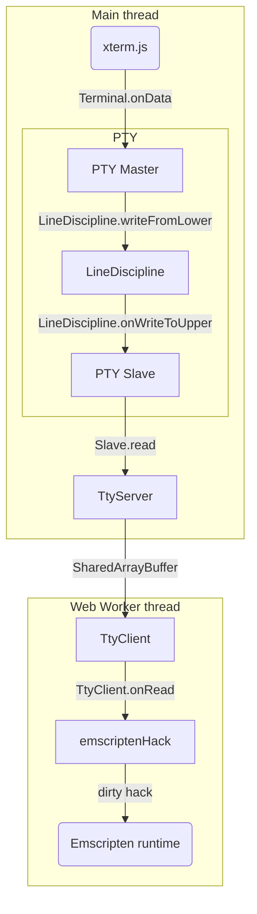
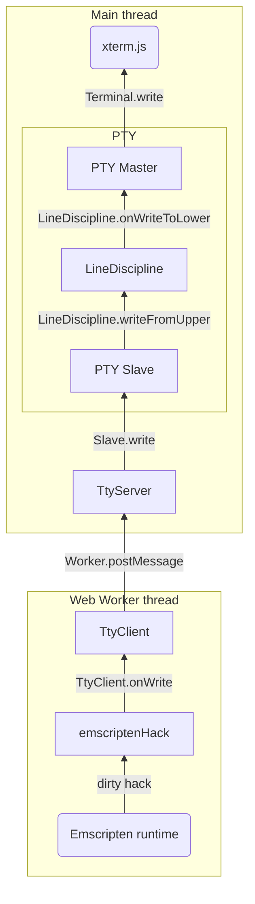

# xterm-pty

This is an addon that adds a PTY layer to xterm.js.
It is useful to run an Emscripten'ed CUI program.

See [the demo site: https://xterm-pty.netlify.app/](https://xterm-pty.netlify.app/).

## How to use

*If you want to use this library to run a CUI program built with [Emscripten](https://emscripten.org/), you can go to [Section "Emscripten integration"](#emscripten-integration).*

Install `xterm-pty` as usual.

```
$ npm i xterm-pty
```

Use `LineDisciplineAddon.write` and `LineDisciplineAddon.onData` instead of `Terminal.write` and `Terminal.onData` of xterm.js.

```js
// Start an xterm.js instance
const xterm = new Terminal();

// Create master/slave objects
const { master, slave } = openpty();

// Connect the master object to xterm.js
xterm.loadAddon(ldiscAddon);

// Use slave.write instead of xterm.write
slave.write("Hello, world!\nInput your name:");

// Use slave.onReadable and slave.read instead of xterm.onData
slave.onReadable(() => {
  xterm.write(`Hi, ${ slave.read().trim() }!\n`);
});
```

Result:

```
Hello, world!

Input your name: Yusuke
Hi, Yusuke!
■
```

## Emscripten integration

TBD

## Component flow

From xterm.js to the Emscripten runtime:



From the Emscripten runtime to xterm.js:

