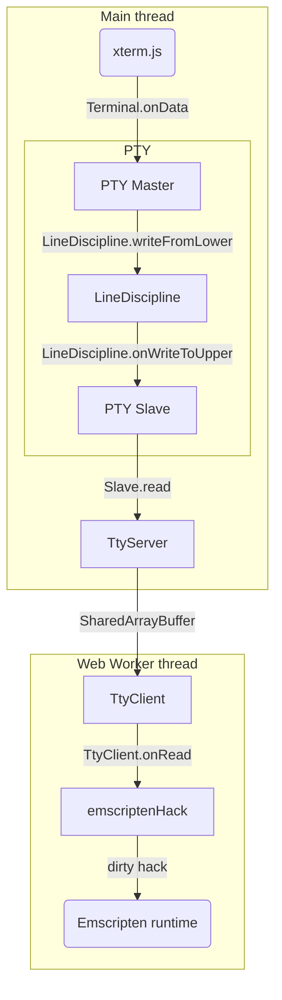
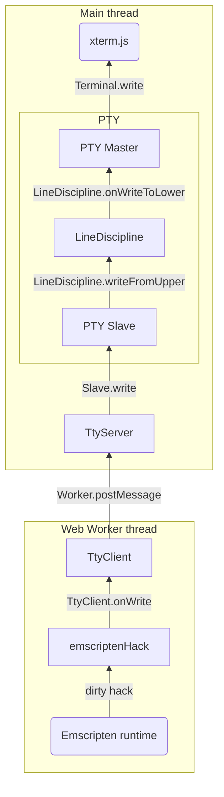

# xterm-pty

This is an addon that adds a PTY layer to xterm.js.
It is useful to run an Emscripten'ed CUI program.

See [the demo site: https://xterm-pty.netlify.app/](https://xterm-pty.netlify.app/).

## How to use

*If you want to use this library to run a CUI program built with [Emscripten](https://emscripten.org/), you can go to [Section "Emscripten integration"](#emscripten-integration).*

Install `xterm-pty` as usual.

```
$ npm i xterm-pty
```

Use `LineDisciplineAddon.write` and `LineDisciplineAddon.onData` instead of `Terminal.write` and `Terminal.onData` of xterm.js.

```js
// Start an xterm.js instance
const xterm = new Terminal();

// Create master/slave objects
const { master, slave } = openpty();

// Connect the master object to xterm.js
xterm.loadAddon(master);

// Use slave.write instead of xterm.write
slave.write("Hello, world!\nInput your name:");

// Use slave.onReadable and slave.read instead of xterm.onData
slave.onReadable(() => {
  xterm.write(`Hi, ${ slave.read().trim() }!\n`);
});
```

Result:

```
Hello, world!

Input your name: Yusuke
Hi, Yusuke!
■
```

## Emscripten integration

Assume you want to run [example.c](https://github.com/mame/xterm-pty/blob/master/demo/build/example.c) in xterm.js.

1. Compile it with Emscripten. Note that you need to specify `-sNO_EXIT_RUNTIME=1 -sFORCE_FILESYSTEM=1`.

```
emcc -sNO_EXIT_RUNTIME=1 -sFORCE_FILESYSTEM=1 -o example-core.js example.c
```

This will generate two files, example-core.js and example-core.wasm.

2. Write a Web Worker script to run example-core.js as follows.

```js
// example.worker.js
importScripts("https://cdn.jsdelivr.net/npm/xterm-pty@0.9.4/workerTools.js");

onmessage = (msg) => {
  importScripts(location.origin + "/example-core.js");

  emscriptenHack(new TtyClient(msg.data));
};
```

The function `emscriptenHack` intercepts some syscall events like TTY read/write, `ioctl`, and `select` in the Emscripten runtime.
The helper class `TtyClient` sends TTY requests to the server that works in the main thread (UI thread).

3. Write a HTML as follows.

```js
<html>
  <head>
    <title>demo</title>
    <link rel="stylesheet" href="https://cdn.jsdelivr.net/npm/xterm@4.17.0/css/xterm.css">
  </head>
  <body>
    <div id="terminal"></div>
    <script src="https://cdn.jsdelivr.net/npm/xterm@4.17.0/lib/xterm.min.js"></script>
    <script src="https://cdn.jsdelivr.net/npm/xterm-pty@0.9.4/index.js"></script>
    <script>
      const xterm = new Terminal();
      xterm.open(document.getElementById("terminal"));

      const { master, slave } = openpty();
      xterm.loadAddon(master);

      const worker = new Worker("./example.worker.js");
      new TtyServer(slave).start(worker);
    </script>
  </body>
</html>
```

It sets up xterm.js, and invokes example.worker.js as a Web Worker.
The helper class `TtyServer` accepts TTY request from the client that works in the Web Worker.

4. Serve all four files, example.html, example.worker.js, example-core.js, and example-core.wasm, with the following custom headers, and access the server with Google Chrome or Firefox.

```
Cross-Origin-Opener-Policy: same-origin
Cross-Origin-Embedder-Policy: require-corp
```

These headers are needed to enable `SharedArrayBuffer`. Note that you need to use Google Chrome or Firefox.

Here is a minimal server script in Ruby:

```rb
require "webrick"

class Server < WEBrick::HTTPServer
  def service(req, res)
    super
    res["Cross-Origin-Opener-Policy"] = "same-origin"
    res["Cross-Origin-Embedder-Policy"] = "require-corp"
  end
end

Server.new(Port: 8080, DocumentRoot: ".").start
```

### Caveats

Currently, `emscriptenHack` rewrites the Emscripten runtime to monitor the following system events.

* eead from the file descripter 0
* write to the file descripters 1 and 2
* ioctl for TCGETS (getting termios), TCSETS and families (setting termios), and TIOCGWINSZ (gettins window size)
* select for TTY (waiting for stdin to be readable)

The hack highly depends on the internal implementation of the Emscripten runtime.
We confirmed that it worked on Emscripten 2.0.13, which is bundled in Ubuntu 21.10.

Also, to use xterm-pty to run an Emscripten'ed process, you need to run it in a Web Worker.
This is because the Emscripten runtime is written as synchronous Javascript code.
When an Emscripten'ed process attempts to read its stdin, the runtime invokes a callback to receive input.
The callback function is *not* `async`, but need to wait synchronously for input from xterm.js.
To achieve this, we need to use `SharedArrayBuffer` and `Atomics.wait`.
This is why the response header described above is needed.

Unfortunately, xterm-pty does not support dynamic change of window size; you cannot use xterm-pty with xterm-addon-fit.
We need to send SIGWINCH signal to tell an Emscripten'ed process when the terminal is resized, but Emscripten does not support signals yet.

## Component flow

From xterm.js to the Emscripten runtime:



From the Emscripten runtime to xterm.js:



## How to build

To build xterm-pty, run:

```
$ npm install && npm run build
```

To build the demo, run:

```
$ cd demo && npm install && npm run build
```

To preview the demo after editing xterm-pty, the following command is useful.

```
cd `git rev-parse --show-toplevel` && npm run build && cd demo && rm -rf node_modules/ && npm install && npm run dev
```
